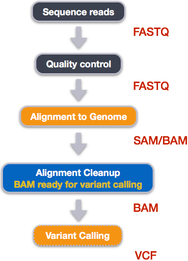

::::::::::::::::::::::::::::::::::::::: objectives

- Understand the steps involved in aligning fastq files and extracting relevant information from the alignments.
- Describe the types of data formats encountered during this workflow.
- Use command line tools to perform alignment and read counting.

::::::::::::::::::::::::::::::::::::::::::::::::::

:::::::::::::::::::::::::::::::::::::::: questions

- How do I find gene expression differences between my samples?

::::::::::::::::::::::::::::::::::::::::::::::::::

We mentioned before that we are working with files from a study of fibroblast to myofibroblast phenoconversion, [Patalano et al. 2018](https://www.doi.org/10.1038/s41598-018-21506-7). Now that we have looked at our data to make sure that it is high quality, and removed low-quality base calls, we can perform alignment and read counting. We care how the three treatments (C = CXCL12, T = TFG-beta, and V = Vehicle control) compare to each other, to understand the roles of each axis in the biological process of phenoconversion.

## Alignment to a reference genome

{alt='workflow\_align'}

We perform read alignment or mapping to determine where in the genome our reads originated from. There are a number of tools to
choose from and, while there is no gold standard, there are some tools that are better suited for particular analyses. We will be
using [HISAT2](https://daehwankimlab.github.io/hisat2/), which is a fast and sensitive alignment program for mapping next-generation sequencing reads (both DNA and RNA) to a population of human genomes as well as to a single reference genome.

The alignment process consists of two steps:

1. Indexing the reference genome
2. Aligning the reads to the reference genome

### Setting up

First we download or access a reference genome for *Homo sapiens*, [GRCh37](https://grch37.ensembl.org/Homo_sapiens/Info/Index). if you remember, we earlier downloaded a README file from the Ensembl database about this genome. We could download the files we need using `curl` or `wget` from the database, but it will take a long time since the files are big! Instead, we have already downloaded them into a shared directory, and we can use `cp` or, to save on storage space, [soft linking](https://kb.iu.edu/d/abbe) to access them.

```bash
$ cd ~/1_project
$ mkdir -p data/genome
$ cd data/genome/
$ ln -s /itcgastorage/data01/itcga_workshops/aug2024_genomics/Genome/hg38/Homo_sapiens.GRCh38.dna.primary_assembly.fa
$ ls
```

```output
Homo_sapiens.GRCh38.dna.primary_assembly.fa
```

Here, `ln -s` creates a symbolic link between the first file and the new name (or location) you have given it. This is really useful when using a shared set of files that you don't want to copy or accidentally mess up. Note that you can give it a new name or a new path, but if you don't it will create a link to the specified file in your current working directory, as it did above.

:::::::::::::::::::::::::::::::::::::::  challenge

### Exercise

We also want to be able to access the gtf, exons, and ss files stored in the same shared directory `/itcgastorage/data01/itcga_workshops/aug2024_genomics/Genome/hg38/`. Make soft links in your `genome` directory for all three files as well.

:::::::::::::::  solution

### Solution

```bash
$ ln -s /itcgastorage/data01/itcga_workshops/aug2024_genomics/Genome/hg38/Homo_sapiens.GRCh38.111.gtf
$ ln -s /itcgastorage/data01/itcga_workshops/aug2024_genomics/Genome/hg38/Homo_sapiens.GRCh38_exons_file.txt
$ ln -s /itcgastorage/data01/itcga_workshops/aug2024_genomics/Genome/hg38/Homo_sapiens.GRCh38_ss_file.txt
```

:::::::::::::::::::::::::

::::::::::::::::::::::::::::::::::::::::::::::::::

### Index the reference genome

Our first step is to index the reference genome for use by HISAT2. Indexing allows the aligner to quickly find potential alignment sites for query sequences in a genome, which saves time during alignment. Indexing the reference only has to be run once. The only reason you would want to create a new index is if you are working with a different reference genome or you are using a different tool for alignment. Make a slurm script to run the indexing, making sure to include the following SBATCH options and to load the following modules before the hisat2-build command:

```bash
#SBATCH --job-name=gindex # you can give your job a name
#SBATCH --ntasks=24 # the number of processors or tasks
#SBATCH --account=itcga # our account
#SBATCH --reservation=ITCGA_AUG2024 # this gives us special access during the workshop
#SBATCH --time=10:00:00 # the maximum time for the job
#SBATCH --mem=32gb # the amount of RAM
#SBATCH --partition=itcga # the specific server in chimera we are using
#SBATCH --error=%x-%A.err   # a filename to save error messages into
#SBATCH --output=%x-%A.out  # a filename to save any printed output into

module load gcc-10.2.0-gcc-9.3.0-f3oaqv7
module load python-3.8.12-gcc-10.2.0-oe4tgov
module load hisat2-2.1.0-gcc-9.3.0-u7zbyow

hisat2-build -p 24 ~/1_project/data/genome/Homo_sapiens.GRCh38.dna.primary_assembly.fa --ss ~/1_project/data/genome/Homo_sapiens.GRCh38_ss_file.txt --exon ~/1_project/data/genome/Homo_sapiens.GRCh38_exons_file.txt ~/1_project/data/genome/hg38
```

Don't forget the `#!/bin/bash/` at the top of your script before you run the job! You could also make the script more generalized by making the genome path a variable given on the command line.

While the index is created, you would see output that looks something like this if you peek in the .err log file your job is creating.

```output
Settings:
  Output files: "..*.ht2"
  Line rate: 7 (line is 128 bytes)
  Lines per side: 1 (side is 128 bytes)
  Offset rate: 4 (one in 16)
  FTable chars: 10
  Strings: unpacked
  Local offset rate: 3 (one in 8)
  Local fTable chars: 6
  Local sequence length: 57344
  Local sequence overlap between two consecutive indexes: 1024
  Endianness: little
  Actual local endianness: little
  Sanity checking: disabled
  Assertions: disabled
  Random seed: 0
  Sizeofs: void*:8, int:4, long:8, size_t:8
Input files DNA, FASTA:
  Homo_sapiens.GRCh38.dna.primary_assembly.fa
```

Indexing can take quite a while, but we wanted to give you the tools to do this if you end up working with a different genome. For not, we can also access the pre-indexed genome in the same directory that we soft-linked from, `/itcgastorage/data01/itcga_workshops/aug2024_genomics/Genome/hg38/`.

Before aligning, let's make a few directories to store the results of our next few steps.

```bash
$ cd ~/1_project
$ mkdir -p results/sam results/bam results/counts
```

#### Align reads to reference genome

The alignment process consists of choosing an appropriate reference genome to map our reads against and then deciding on an aligner. We will use the HISAT2 program because it performs well with human RNA-Seq data.

An example of what a `hisat2` command looks like is below. This command will not run, as we do not have the files `genome.fa`, `input_file_R1.fastq`, or `input_file_R2.fastq`.

```bash
$ hisat2 -p 24 -x /itcgastorage/data01/itcga_workshops/aug2024_genomics/Genome/hg38/hg38 -1 input_file_R1.fastq -2 input_file_R2.fastq -S ~/1_project/results/sam/output_file.sam
```

On chimera, we'll need to load these modules (same as we did for indexing):
```bash
$ module load gcc-10.2.0-gcc-9.3.0-f3oaqv7
$ module load python-3.8.12-gcc-10.2.0-oe4tgov
$ module load hisat2-2.1.0-gcc-9.3.0-u7zbyow
```

Have a look at the [HISAT2 options page](https://daehwankimlab.github.io/hisat2/manual/). While we are running HISAT2 with the default parameters here, different uses might require a change of parameters. *NOTE: Always read the manual page for any tool before using and make sure the options you use are appropriate for your data.*

We are going to start by aligning the reads from just one of the
samples in our dataset (the trimmed pair of `V1_S1_L001` FASTQ files). Later, we will be iterating this whole process on all of our sample files.

```bash
$ hisat2 -p 24 -x /itcgastorage/data01/itcga_workshops/aug2024_genomics/Genome/hg38/hg38 -1 ~/1_project/data/trim_fastq/V1_S1_L001_R1_001_ds_trim.fastq -2 ~/1_project/data/trim_fastq/V1_S1_L001_R2_001_ds_trim.fastq -S ~/1_project/results/sam/V1_S1_L001_ds_trim_align.sam
```

You will see output that looks like this:

```output
961680 reads; of these:
  961680 (100.00%) were paired; of these:
    450677 (46.86%) aligned concordantly 0 times
    440285 (45.78%) aligned concordantly exactly 1 time
    70718 (7.35%) aligned concordantly >1 times
    ----
    450677 pairs aligned concordantly 0 times; of these:
      4041 (0.90%) aligned discordantly 1 time
    ----
    446636 pairs aligned 0 times concordantly or discordantly; of these:
      893272 mates make up the pairs; of these:
        857773 (96.03%) aligned 0 times
        25122 (2.81%) aligned exactly 1 time
        10377 (1.16%) aligned >1 times
55.40% overall alignment rate
```

Overall, a bit over half of the reads in this sample aligned to the reference genome we are using (overall alignment rate), and most of these aligned to a single location, the same place in the genome as their pair ("aligned concordantly exactly one time"). A small proportion of reads did something else: aligned in a pair in more than one genome position ("aligned concordantly >1 time"), aligned but each pair was in a different location ("aligned discordantly"), or only one of the pair aligned ("pairs aligned 0 times", "mates... aligned"). This isn't great for a sequence file that has gone through quality control, but it is still workable for us!

##### SAM/BAM format

The [SAM file](https://genome.sph.umich.edu/wiki/SAM),
is a tab-delimited text file that contains information for each individual read and its alignment to the genome. While we do not have time to go into detail about the features of the SAM format, the paper by [Heng Li et al.](https://bioinformatics.oxfordjournals.org/content/25/16/2078.full) provides a lot more detail on the specification.

**The compressed binary version of SAM is called a BAM file.** We use this version to reduce size and to allow for *indexing*, which enables efficient random access of the data contained within the file.

The file begins with a **header**, which is optional. The header is used to describe the source of data, reference sequence, method of alignment, etc., this will change depending on the aligner being used. Following the header is the **alignment section**. Each line that follows corresponds to alignment information for a single read. Each alignment line has **11 mandatory fields** for essential mapping information and a variable number of other fields for aligner specific information. An example entry from a SAM file is displayed below with the different fields highlighted.

{alt='sam\_bam1'}

{alt='sam\_bam2'}

We will convert the SAM file to BAM format using the `samtools` program with the `view` command (yeah, it's a funny name for the conversion process) and tell this command that the input is in SAM format (`-S`) and to output BAM format (`-b`). First we'll need to load the samtools module.

```bash
$ module load samtools-1.10-gcc-9.3.0-flukja5
$ cd ~/1_project
$ samtools view -S -b results/sam/V1_S1_L001_ds_trim_align.sam > results/bam/V1_S1_L001_ds_trim_align.bam
```

This process can take a little while! You can speed it up using the `-@` option to allocate additional CPUs to the task (e.g., try `-@ 4`).

#### Sort BAM file by coordinates

Next we sort the BAM file using the `sort` command from `samtools`. `-o` tells the command where to write the output. Notice that we are saving the file back into the same name, so the previous unsorted file will be overwritten by the sorted one. This saves us some space, but might be a bad idea if want to know which files are sorted and which are not. In that case, you would give the output a different name.

```bash
$ samtools sort -o results/bam/V1_S1_L001_ds_trim_align.bam results/bam/V1_S1_L001_ds_trim_align.bam
```

Our files are pretty small, so we will not see this output. If you run the workflow with larger files, you might see something like this:

```output
[bam_sort_core] merging from 2 files...
```

SAM/BAM files can be sorted in multiple ways, e.g. by location of alignment on the chromosome, by read name, etc. It is important to be aware that different alignment tools will output differently sorted SAM/BAM, and different downstream tools require differently sorted alignment files as input. The default, which we are using here, is to sort by the alignment coordinates in the reference genome.

You can use samtools to learn more about this sorted bam file as well.

```bash
samtools flagstat results/bam/V1_S1_L001_ds_trim_align.bam
```

This will give you the following statistics about your sorted bam file:

```output
2280568 + 0 in total (QC-passed reads + QC-failed reads)
357208 + 0 secondary
0 + 0 supplementary
0 + 0 duplicates
1422795 + 0 mapped (62.39% : N/A)
1923360 + 0 paired in sequencing
961680 + 0 read1
961680 + 0 read2
1022006 + 0 properly paired (53.14% : N/A)
1039730 + 0 with itself and mate mapped
25857 + 0 singletons (1.34% : N/A)
15468 + 0 with mate mapped to a different chr
11429 + 0 with mate mapped to a different chr (mapQ>=5)
```

:::::::::::::::::::::::::::::::::::::::  challenge

### Exercise
What do these different values mean? You might think to start with `samtools flagstat --help`, but that just gives you the options for the command. What could you do to find out more?

:::::::::::::::  solution

### Solution
There are two common approaches to this kind of challenge:

1. It is a good idea to start with the full documentation or manual, which is usually available online. The manual for samtools and associated programs is [from HTSlib here](https://www.htslib.org/doc/#manual-pages), but it is not immediately clear how to find the information on the flagstat command. You can find [the specific manual page here](https://www.htslib.org/doc/samtools-flagstat.html) after a little poking around.

2. If the manual doesn't help you, you can also try searching the internet with your question. Good search terms are specific and clear. In this case, you could try "samtools flagstat output". The first hit (at least for me) is the manual, but the second is [a forum post](https://www.biostars.org/p/84396/) on Biostars that might be helpful!

If these two approaches don't work, you can also talk to someone else working on similar problems, make your own post on a help forum, or reach out to the people who made the program (see the attribution or citation)!
:::::::::::::::::::::::::

::::::::::::::::::::::::::::::::::::::::::::::::::


In order for us to do some of our next steps, we will need to index the BAM file using `samtools`:

```bash
$ samtools index results/bam/V1_S1_L001_ds_trim_align.bam
```

## Feature (read) counting

Read counting is calculating the number of reads for a particular sample that align to the reference at a given position, possibly at a gene or part of a gene. Similar to other steps in this workflow, there are a number of tools available for read counting. In this workshop we will be using `featureCount`. Our final output here will be a matrix with genes or other genomic features as rows and samples as columns, with the number of reads aligned to that feature in that sample in each cell.

{alt='workflow'}

```bash
featureCounts -a $gtf_file -o ${counts_dir}/${sample}_counts.txt -T 24 -p -B -C ${bam_files[$SLURM_ARRAY_TASK_ID-1]}
```

:::::::::::::::::::::::::::::::::::::::  challenge

### Exercise


:::::::::::::::  solution

### Solution


:::::::::::::::::::::::::

::::::::::::::::::::::::::::::::::::::::::::::::::


## Automation

Now that we have run through our workflow for a single sample, we want to repeat this workflow for our other samples. However, we do not want to type each of these individual steps again each time. That would be very time consuming and error-prone, and would become impossible as we gathered more and more samples. Luckily, we already know the tools we need to use to automate this workflow and run it on as many files as we want using a single line of code. Those tools are: wildcards, for loops, bash scripts, and job submission with slurm. **Your challenge is to do this!**

Once you have all the samples aligned, compressed to bam, sorted, indexed, and feature counted, we're ready to do some data science!


:::::::::::::::::::::::::::::::::::::::::  callout

### Installing software

It is worth noting that all of the software we are using for this workshop has been pre-installed on our remote computer. This saves us a lot of time—installing software can be a time-consuming and frustrating task—however, this does mean that you will not be able to walk out the door and start doing these analyses on your own computer. You will need to install the software first. Look at the [setup instructions](https://datacarpentry.org/genomics-workshop/index.html#setup) for more information on installing these software packages.


::::::::::::::::::::::::::::::::::::::::::::::::::

:::::::::::::::::::::::::::::::::::::::::  callout

### HISAT2 alignment options

HISAT2 consists of three algorithms: HISAT2-backtrack, HISAT2-SW and HISAT2-MEM. The first algorithm is designed for Illumina sequence
reads up to 100bp, while the other two are for sequences ranging from 70bp to 1Mbp. HISAT2-MEM and HISAT2-SW share similar features such
as long-read support and split alignment, but HISAT2-MEM, which is the latest, is generally recommended for high-quality queries as it
is faster and more accurate.


::::::::::::::::::::::::::::::::::::::::::::::::::

:::::::::::::::::::::::::::::::::::::::: keypoints

- Bioinformatic command line tools are collections of commands that can be used to carry out bioinformatic analyses.
- To use most powerful bioinformatic tools, you will need to use the command line.
- There are many different file formats for storing genomics data. It is important to understand what type of information is contained in each file, and how it was derived.

::::::::::::::::::::::::::::::::::::::::::::::::::


