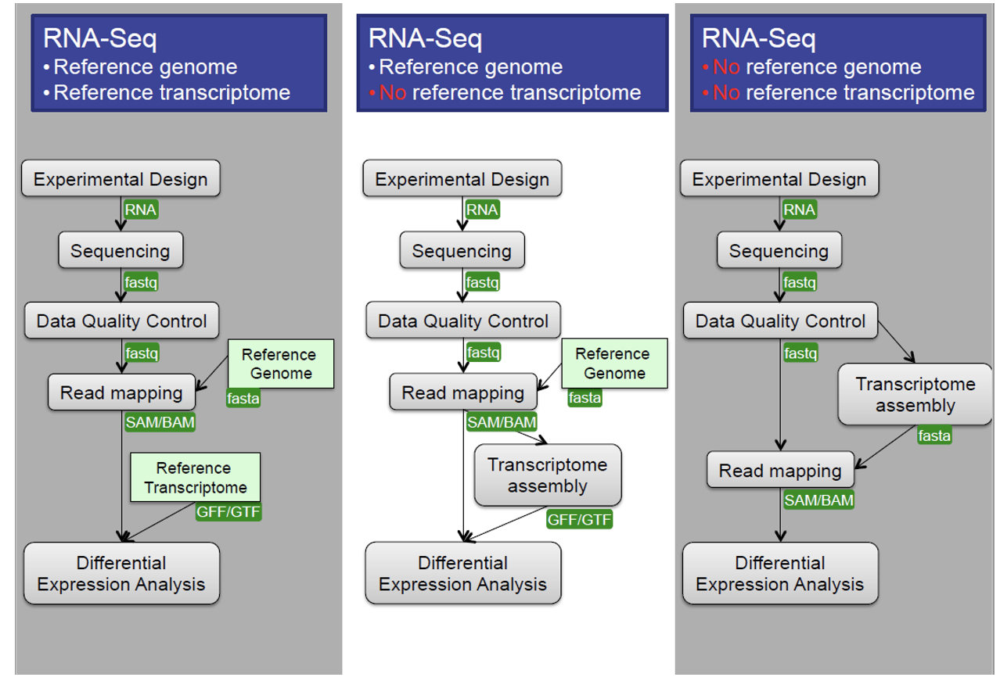
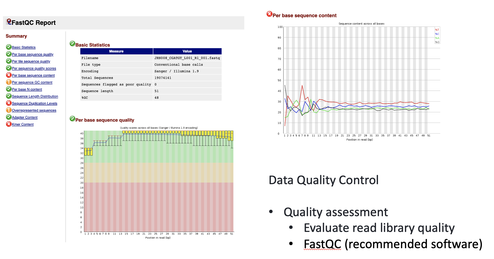
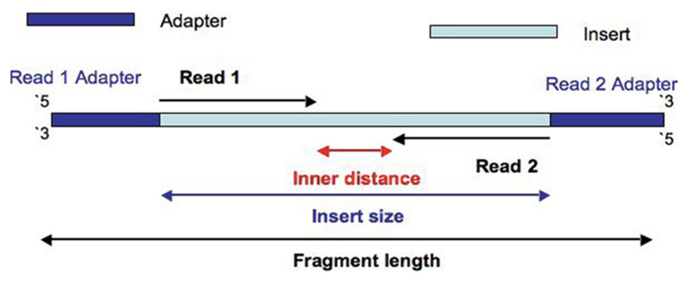
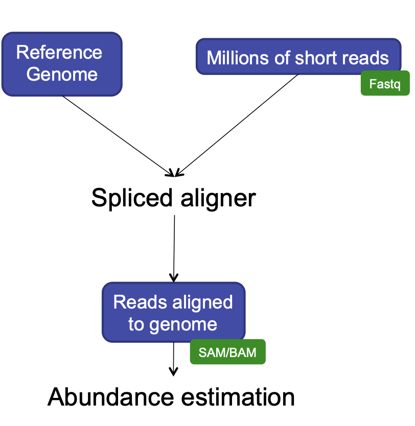
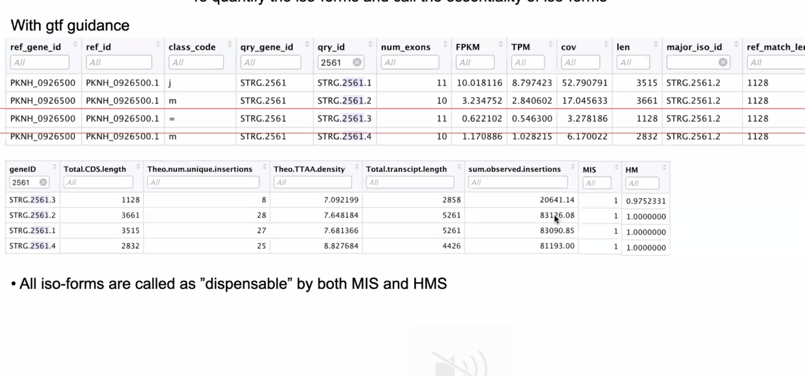
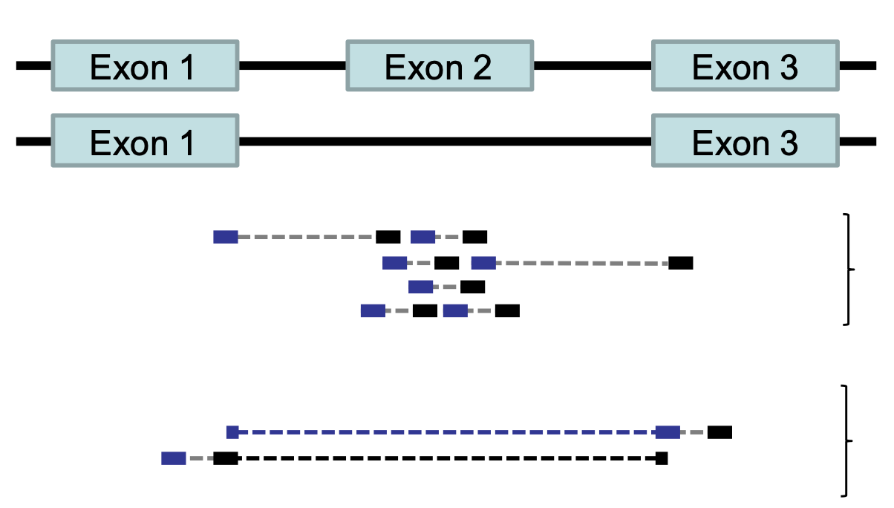
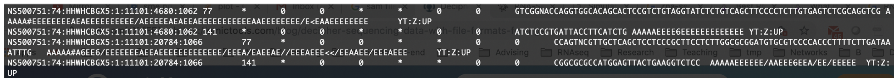
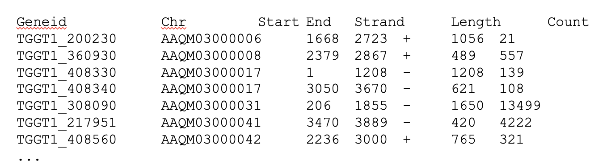
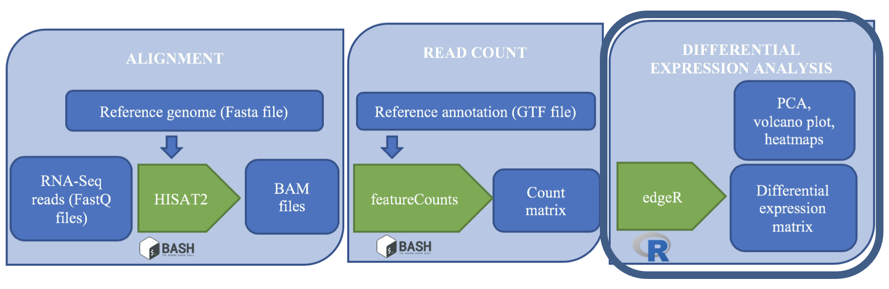
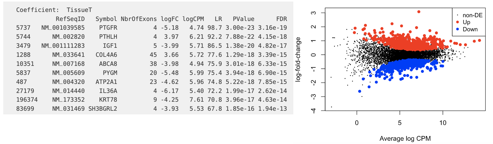

::::::::::::::::::::::::::::::::::::::: objectives

- Normalize and process read counts for downstream analysis.
- Use a prepared R script on the command line to generate analysis results.

::::::::::::::::::::::::::::::::::::::::::::::::::

:::::::::::::::::::::::::::::::::::::::: questions

- How do we statistically identify and visualize differential gene expression patterns?

::::::::::::::::::::::::::::::::::::::::::::::::::


:::::::::::::::::::::::::::::::::::::::  challenge

### Exercise

It is a good idea to add comments to your code so that you (or a collaborator) can make sense of what you did later.
Look through your existing scripts. Discuss with a neighbor where you should add comments. Add comments (anything following
a `#` character will be interpreted as a comment, bash will not try to run these comments as code).

::::::::::::::::::::::::::::::::::::::::::::::::::

## Analyzing Feature Count Data

{alt='workflow'}

We made it to the end of this analysis pipeline! Now we have read count data for samples across the human genome feature like genes and parts of genes. After this, our analyses become less like a pipeline and more like statistics. We're going to think more about how to analyze count data in this episode. First, a quick review of the steps we took and our reasoning for those choices.

### Central Data Analysis Themes

- **Mapping to Transcriptome:** No novel transcript discovery
- **Mapping to Genome**
- **De Novo Assembly:** When no reference genome is available

{alt='Three ways to analyze RNA-Seq data'}

### Data Quality Control
We learned and applied these approaches in previous episodes.

**Quality Assessment:** Evaluate read library quality using tools like FastQC.

{alt='Quality control visuals'}

**Filtering and Trimming:**
  - Trim low-quality bases and adapter contamination from reads.
  - Filter out low-quality reads and sequence repeats.
  - Remove short reads (for example, <25 bp).
  
{alt='Removing unwanted or low-quality sequence'}

### Alignment to Reference Genome

#### Alignment Protocols

- **Short Sequence Aligners:** BWA, Bowtie2
- **RNA-Seq Specific:** TopHat2, HISAT2, STAR

{alt='How RNA-Seq data are aligned'}

### HISAT2
We used this program for alignment because it has a short processing time, simple quantification method (read counts), and differential analysis has low false positives.

{alt='hisat2 will identify alternative splice forms'}

#### HISAT2 is splicing aware
- Unlike DNA alignment, RNA-Seq reads may span across introns due to differences in splicing.
- Usually 35% of reads will span multiple exons
- HISAT2 is a splice aware aligner (based on Bowtie2, uses many genome index files)
- Runs significantly faster than Bowtie2 and uses ~8Gb of memory
- On 100 million reads, it takes about 1 hour to finish the alignment process.

{alt='Multiple mRNA molecules can be spliced from the same transcribed sequence'}

#### RNA-Seq: HISAT2 output
```
hisat2 --threads 20 -x ../grch38/genome --known-splicesite-infile ../HS_hisat2_known_splice_sites.txt -1 ../trim_galore_out/JRN008_CGATGT_L001_R1_001_val_1.fq -2 ../trim_galore_out/JRN008_CGATGT_L001_R2_001_val_2.fq -S ./hisat2_out/JRN008_CGATGT_L001.sam
```

- Output:
  - SAM / BAM  alignment files
  - Software: SAMtoold
  - Contain statistics:
  - Uniquely mapped reads
  - Reads with multiple alignment
  - Unmapped reads
  - Properly paired reads

{alt='Typical hisat2 output in sam format'}

### featureCounts

- featureCounts takes as input SAM/BAM files and an annotation file as input.
- It outputs numbers of reads assigned to features (or meta-features). 
- It also outputs stat info for the overall summarization results.

```
featureCounts -T 5 -t exon -g gene_id -a ../annotation.gtf -o ../counts.txt ./hisat2_out/JRN008_CGATGT_L001.sam
```
{alt='Typical featureCounts output'}

### edgeR
{alt='Now the workflow moves from bash to R'}

edgeR is a Bioconductor R package that implements statistical methods based on generalized linear models (glms), suitable for multi-factor experiments of any complexity. edgeR can be applied to differential expression at the gene, exon, transcript or tag level for any design.

**Code Example** (note that this written in the language R):
  ```
  design <- model.matrix(~treatment)
  CPM <- cpm(counts[2:ncol(counts)])
  y <- DGEList(counts=x, group=treatment)
  y <- calcNormFactors(y)
  fit <- glmQLFit(new.y, new.design, robust=TRUE)
  qlf <- glmQLFTest(fit)
  tt <- topTags(qlf)
  summary(decideTests(qlf))
  plotMD(qlf)
  ```
  
{alt='edgeR output shows differentially expressed gene table and a volcano plot'}

:::::::::::::::::::::::::::::::::::::::: keypoints

- Our downstream steps take us into new territory: the R language.
- You can run R scripts on the command line.

::::::::::::::::::::::::::::::::::::::::::::::::::


