::::::::::::::::::::::::::::::::::::::: objectives

- Learn about the history, current status, and a typical analysis workflow of gene expression research.
- How do we design useful RNA-Seq experiments?
- Understand the data set through metadata.

::::::::::::::::::::::::::::::::::::::::::::::::::

:::::::::::::::::::::::::::::::::::::::: questions

- What is RNA-Seq?
- What data are we using?
- Why is this experiment important?

::::::::::::::::::::::::::::::::::::::::::::::::::

### RNA Sequencing Overview

#### What is RNA-Seq?

RNA Sequencing (RNA-Seq) is a powerful technology used to analyze the transcriptome of a sample by sequencing RNA molecules.

**Key Applications:**
  - Gene expression profiling
  - Differential Gene Expression
  - Discovery of novel transcripts
  - Analysis of alternative splicing events
  - Study of non-coding RNAs

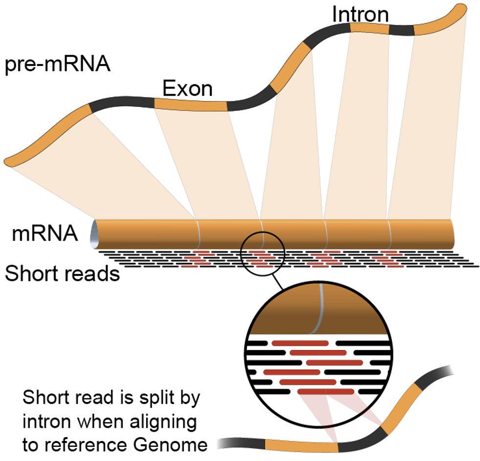

#### RNA-Seq Workflow

- **RNA Extraction:** RNA is extracted from the biological material of choice (e.g., cells, tissues).
- **Library Preparation:** The RNA is converted to complementary DNA (cDNA) by reverse transcription
- **Adapter Ligation:** Sequencing adaptors are ligated to the ends of the cDNA fragments.
- **Sequencing:** Following amplification, the RNA-Seq library is ready for sequencing.

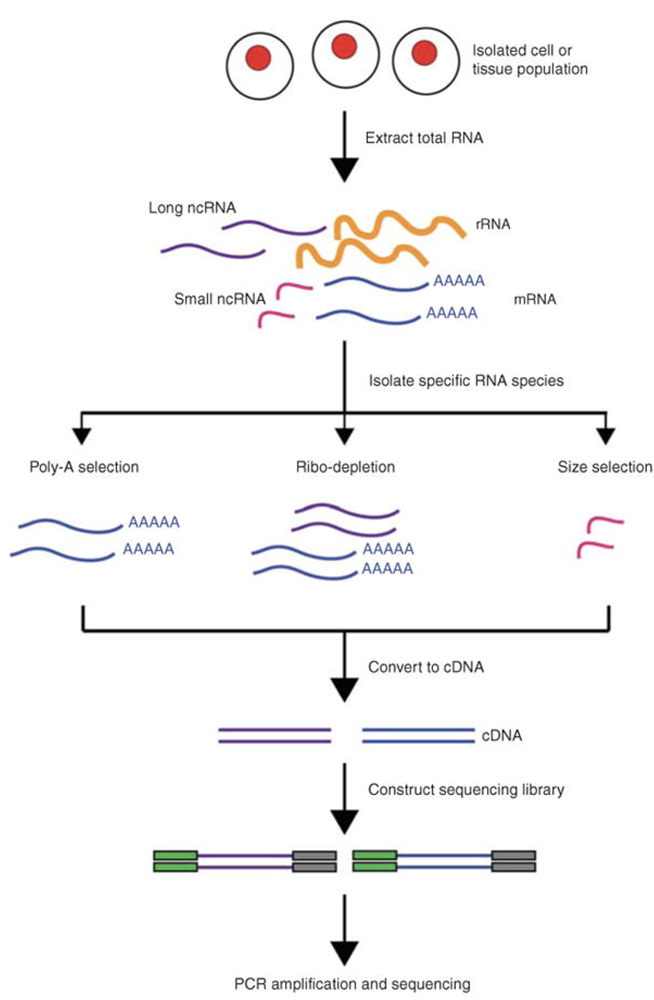

### Sequencing on Illumina Platforms

Illumina sequencing uses Sequencing by Synthesis (SBS) technology where nucleotides are incorporated into a growing DNA strand and the sequence is determined by the order of incorporation. 

Key Illumina Platforms:

**MiSeq:** Older, still sometimes used for RNA-Seq or amplicon sequencing
**NovaSeq:** High-throughput suitable for large-scale studies
**NextSeq:** Flexible, ideal for smaller labs

### DNA MicroArray (Older Technology)

- DNA microarrays can simultaneously measure the expression level of thousands of genes within a particular mRNA sample
- The key physicochemical process involved in microarrays is DNA hybridization. Two DNA strands hybridize if they are complementary to each other, according to the Watson-Crick rules (A-T, C-G)
- mRNA is extracted from tissues or cells, reversed-transcribed and labeled with a dye (usually fluorescent), and hybridized on the array
- The next step is to generate an image using laser-induced fluorescent imaging
- The principle behind the quantification of expression levels is that the amount of fluorescence measured at each sequence-specific location is directly proportional to the amount of mRNA with complementary sequence present in the sample analyzed (relative not absolute expression)

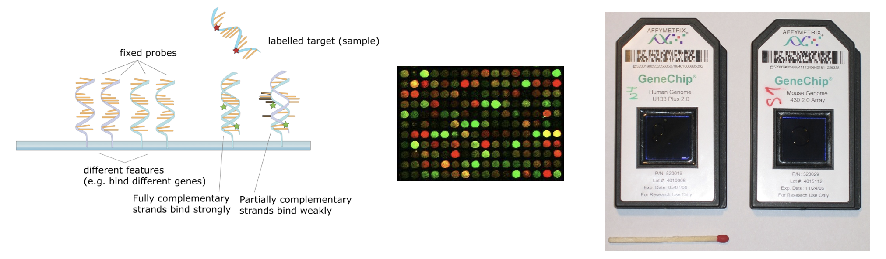

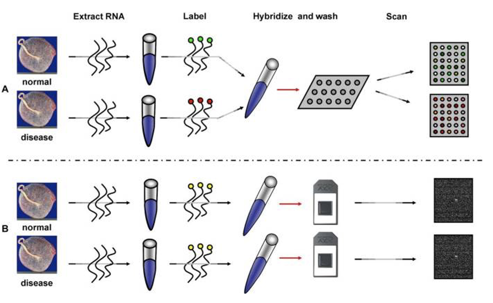

- The upper panel illustrates the two channel technology while the lower panel illustrates the single channel technology.
- The experiment is designed to compare the mRNA expression between two conditions( normal vs. disease). 
mRNA  is extracted. In the top panel, the normal and disease mRNA are labeled with two different dyes, mixed and then hybridized on the same array. After washing, the array is scanned at two different wavelengths to yield two images
- In the bottom panel B (single channel), each sample is labeled with the same fluorescent dye, but independently hybridized on different arrays.
- Affymetrix GeneChip: oligonucleotide, single-channel array
- Terminology: "probe" is the nucleotide sequence that is attached to the microarray surface. “target” in microarray experiments refers to what is hybridized to the probes.

#### RNA-Seq Advantages

Unlike microarrays, RNA-Seq provides a more comprehensive view of the transcriptome, including novel transcripts and alternative splicing events. The output is typically in the form of FASTQ files, exactly like the ones we have been working with so far.

#### Fastq File Format

- **Location on Cluster:** `/project/PI-groupname/project_name/`
- **Filenames:**
  - `L1_R1_CCAAT_XXX.fastq`
  - `L1_R2_CCAAT_XXX.fastq`

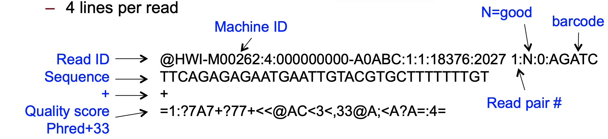

### Central Data Analysis Themes

- **Mapping to Transcriptome:** No novel transcript discovery
- **Mapping to Genome**
- **De Novo Assembly:** When no reference genome is available

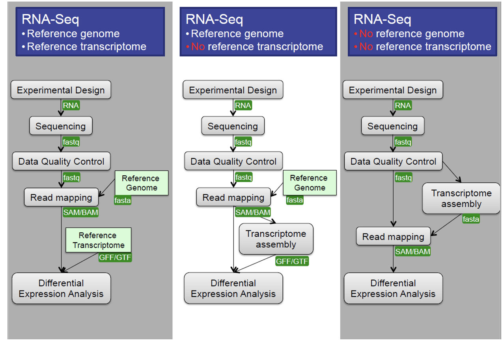

### Data Quality Control

**Quality Assessment:** Evaluate read library quality using tools like FastQC.

**Filtering and Trimming:**
  - Remove low-quality bases from reads.
  - Filter out low-quality reads and sequence repeats.
  - Remove short reads (< 20bp).

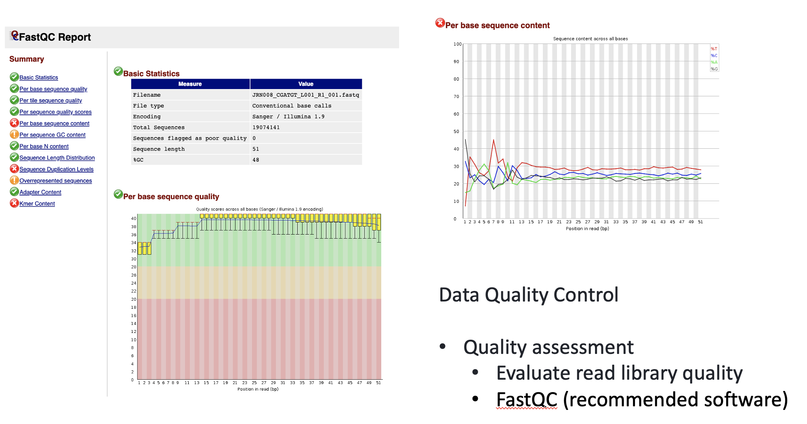
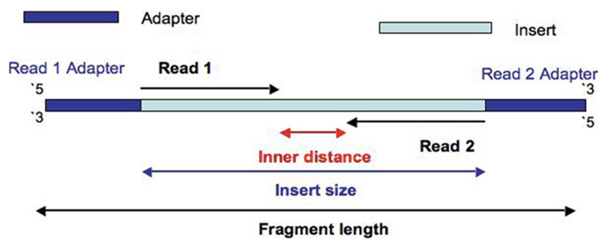

### Alignment to Reference Genome

#### Alignment Protocols

- **Short Sequence Aligners:** BWA, Bowtie2
- **RNA-Seq Specific:** TopHat2, HISAT2, STAR

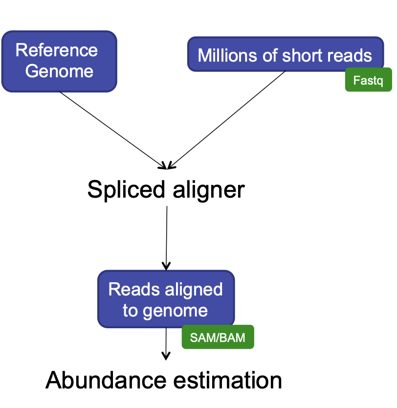

### HISAT2

We will be using this program for alignment, because it has a short processing time, simple quantification method (read counts), and differential analysis has low false positives.

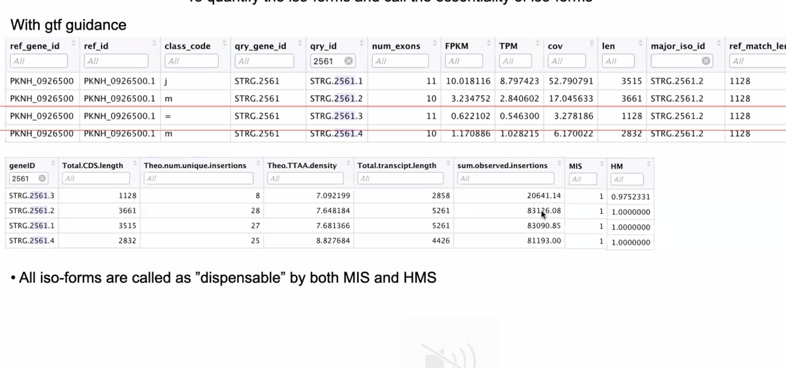

#### HISAT2 is splicing aware
- Unlike DNA alignment, RNA-Seq reads may span across introns due to differences in splicing.
- Usually 35% of reads will span multiple exons
- HISAT2 is a splice aware aligner (based on Bowtie2, uses many genome index files)
- Runs significantly faster than Bowtie2 and uses ~8Gb of memory
- On 100 million reads, it takes about 1 hour to finish the alignment process.

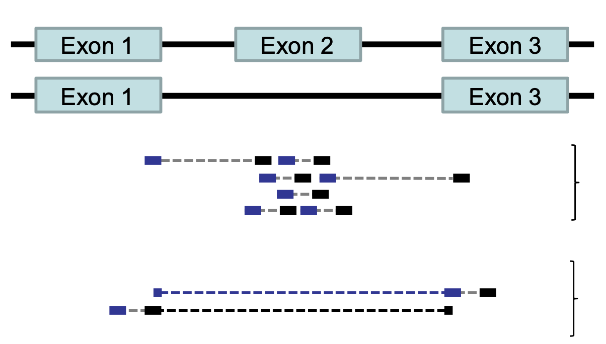

#### RNA-Seq: HISAT2 output
```
hisat2 --threads 20 -x ../grch38/genome --known-splicesite-infile ../HS_hisat2_known_splice_sites.txt -1 ../trim_galore_out/JRN008_CGATGT_L001_R1_001_val_1.fq -2 ../trim_galore_out/JRN008_CGATGT_L001_R2_001_val_2.fq -S ./hisat2_out/JRN008_CGATGT_L001.sam
```

- Output:
  - SAM / BAM  alignment files
  - Software: SAMtoold
  - Contain statistics:
  - Uniquely mapped reads
  - Reads with multiple alignment
  - Unmapped reads
  - Properly paired reads

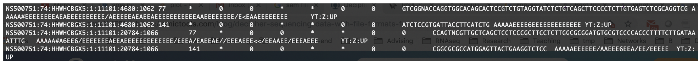

### featureCounts

- featureCounts takes as input SAM/BAM files and an annotation file as input.
- It outputs numbers of reads assigned to features (or meta-features). 
- It also outputs stat info for the overall summarization results.

```
featureCounts -T 5 -t exon -g gene_id -a ../annotation.gtf -o ../counts.txt ./hisat2_out/JRN008_CGATGT_L001.sam
```
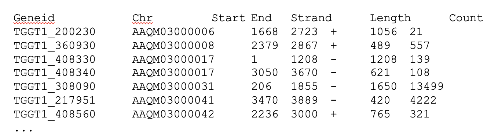

### edgeR
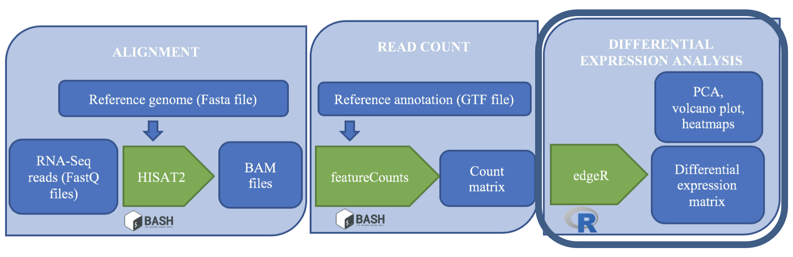

edgeR is a Bioconductor R package that implements statistical methods based on generalized linear models (glms), suitable for multi-factor experiments of any complexity. edgeR can be applied to differential expression at the gene, exon, transcript or tag level for any design.

**Code Example** (note that this written in the language R):
  ```
  design <- model.matrix(~treatment)
  CPM <- cpm(counts[2:ncol(counts)])
  y <- DGEList(counts=x, group=treatment)
  y <- calcNormFactors(y)
  fit <- glmQLFit(new.y, new.design, robust=TRUE)
  qlf <- glmQLFTest(fit)
  tt <- topTags(qlf)
  summary(decideTests(qlf))
  plotMD(qlf)
  ```
  
  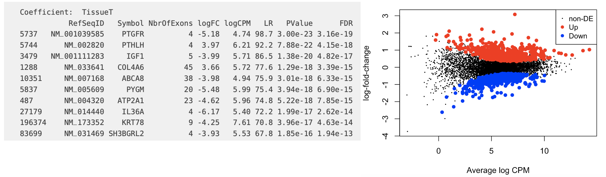

## RNA-Seq Experimental Planning

Thoughtful experimental design is the foundation of a successful RNA-Seq study, leading to robust and reproducible results. Proper experimental design ensures that the data generated is reliable, reproducible, and has the signal strength to draw meaningful biological results. Key aspects include selecting appropriate replicates, collecting detailed metadata, and considering sources of variability.

## The data

We will be working with data from...

# Metadata in RNA-Seq

  - Metadata refers to the descriptive information about samples.
  - This includes biological details (e.g., tissue type, cell type, condition, treatment) and technical details such as library prep method, sequencing platform, sequencing depth, and sequencing batch.
  - Detailed metadata is essential for understanding and interpreting the RNA-Seq data.
  - Proper metadata annotation allows for better reproducibility and data sharing.

- **Example:**
  - Consider a case-control study, where we are interested in changes in gene expression in treated vs. untreated cells. Treatment can refer to different growth conditions, disease vs. normal, treated with a drug or vehicle.
  - Metadata should include the treatment type, dosage, duration, cell line, and batch number.

## Example Metadata Table

| Sample_ID | Condition  | Treatment | Time_Point | Tissue_Type | Batch | Sequencing_Run | Library_Prep_Kit | RNA_Concentration (ng/µL) |
|-----------|------------|-----------|------------|-------------|-------|----------------|------------------|---------------------------|
| Sample_01 | Control    | None      | 0 hours    | Liver       | 1     | Run_01         | Kit_A            | 200                       |
| Sample_02 | Treated    | Drug_X    | 6 hours    | Liver       | 1     | Run_01         | Kit_A            | 210                       |
| Sample_03 | Control    | None      | 12 hours   | Liver       | 1     | Run_02         | Kit_B            | 190                       |
| Sample_04 | Treated    | Drug_X    | 24 hours   | Liver       | 2     | Run_02         | Kit_B            | 220                       |
| Sample_05 | Control    | None      | 0 hours    | Heart       | 2     | Run_03         | Kit_A            | 230                       |
| Sample_06 | Treated    | Drug_X    | 6 hours    | Heart       | 2     | Run_03         | Kit_A            | 215                       |
| Sample_07 | Control    | None      | 12 hours   | Heart       | 3     | Run_04         | Kit_B            | 205                       |
| Sample_08 | Treated    | Drug_X    | 24 hours   | Heart       | 3     | Run_04         | Kit_B            | 225                       |

### Metadata Explanation

- **Sample_ID:** A unique identifier for each sample.
- **Condition:** Indicates the experimental condition (e.g., control, treated).
- **Treatment:** Details of any treatment applied to the samples (e.g., Drug_X).
- **Time_Point:** The time point at which the sample was collected.
- **Tissue_Type:** The type of tissue from which the sample was extracted.
- **Batch:** The batch number indicating when the samples were processed.
- **Sequencing_Run:** The specific sequencing run in which the sample was sequenced.
- **Library_Prep_Kit:** The kit used for sequencing library preparation.
- **RNA_Concentration:** The concentration of RNA in the sample, which is important for assessing sample quality.

### Biological and Technical Replicates

  - Biological replicates are independent samples from the same experimental condition.
  - They capture natural biological variability, which is crucial for generalizing results.
  - These replicates are crucially needed for downstream statistical analysis.
  - Technical replicates involve repeating the same sample processing steps (e.g., sequencing, library prep) to assess technical variability (instrument measurement noise).

  - Replicates increase the reliability of your findings by allowing for statistical analysis.
  - It is highly recommended to generate at least 3 biological replicates per condition to ensure sufficient statistical power for detecting differential expression.

### Randomization and Block Design

  - Randomization refers to randomly assigning samples to different experimental conditions or processing orders to minimize bias.
  - Randomization helps to evenly distribute confounding factors (e.g., time of day, machine variability) across all experimental conditions.
  - Block design is a strategy where samples are grouped into blocks that share a common characteristic (e.g., batch) to control for known sources of variability.

- **Example:**
  - If you are processing samples in different batches, you can randomize the order of sample processing within each batch to avoid systematic errors.

  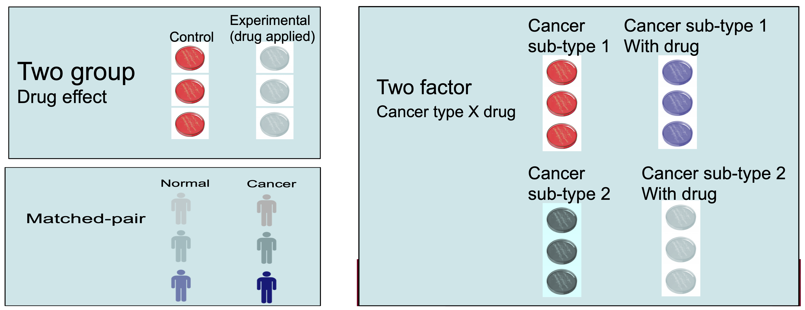
  
### Confounding Factors and Batch Effects

  - Confounding factors are variables that can influence the outcome of the experiment without being of direct interest (e.g., technician handling, machine type, sequencing center).
  - Batch effects are unwanted variations that arise from differences in sample processing or sequencing batches.
  - Confounding factors and batch effects can obscure the true biological signals in the data.
  - **Design stage:** Include batch as a factor in your experimental design.
  - **Analysis stage:** Apply batch effect correction methods, such as ComBat or include batch as a covariate in the statistical model.


:::::::::::::::::::::::::::::::::::::::  challenge

### Challenge

Based on the information `metadata.csv` in `~/itcga_workshop/metadata/`, can you answer the following questions?

1. How many different fastq files do we have?
2. How many rows and how many columns are in this data?
3. How many CXCL12-treated samples do we have? Note that each sample has more than one associated file.

:::::::::::::::  solution

### Solution

1. 36 files
2. 36 rows, 6 columns
3. Three samples (S4,S5,S6), each with four files (PE = R1 & R2 on lane = L1 & L2)

:::::::::::::::::::::::::

::::::::::::::::::::::::::::::::::::::::::::::::::


:::::::::::::::::::::::::::::::::::::::: keypoints

  - It is important to record and understand your experiment's metadata.
  - Carefully plan your experiment to account for potential sources of variability.
  - Use appropriate numbers of biological replicates and consider technical replicates where necessary.
  - Randomize sample processing and use block designs to minimize bias.
  - Address batch effects during both the design and analysis stages.

::::::::::::::::::::::::::::::::::::::::::::::::::


